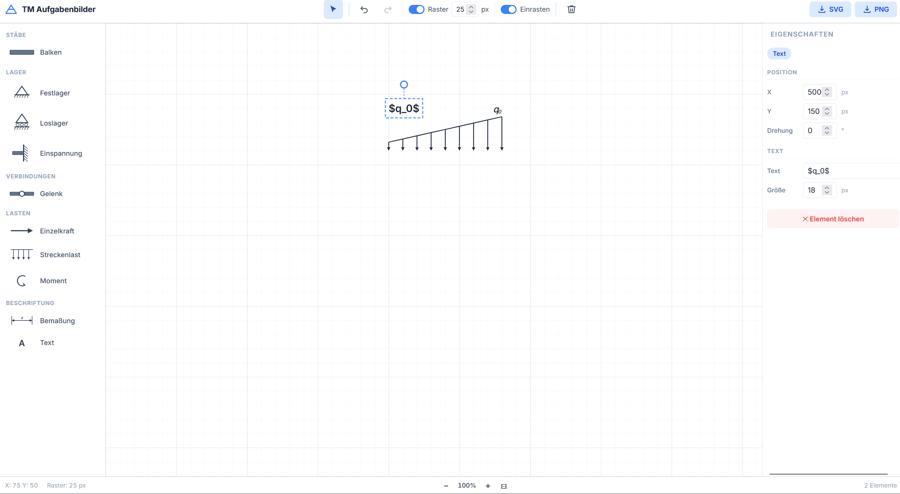
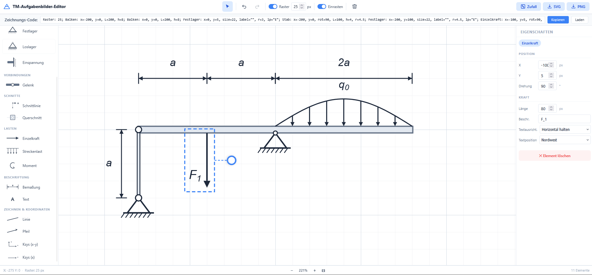

# Prompts

This project was primarily generated with AI assistance. The prompts and my reasoning below are shared for transparency and reproducibility.

## Tooling
- Model: Claude Opus 4.8, Gemini 3.5 Flash in Google Antigravity IDE
- Date: 08.07.2026 - 11.07.2026

## Prompt 1 for initial scaffold
> I want to create a design tool called "stabbalkenlastlagerungen" for building task-images for the subject "Technische Mechanik".
> The software should be a SVG drawing tool which offers a set of tools to create beams, bearings, and loadings. The tool should be able to create drawings like the one attached.
> Specifications:
> - It should run completely in the browser.
> - It should export an SVG version and a PNG version of the task.
> - There should be a background grid in the drawing space. Different beam or bar parts should be dropped in and snap to the grid.
> - The connections between the parts should be clickable and changeable, e.g., to ball bearings (Gelenke).
> - Furthermore, other bearings (Festlager, Loslager, Einspannung) should be dropped in.
> - Keep in mind that there should be the possibility to rotate the parts.

### Initial output:

## Subsequent Prompts for features and error correction

> Add the possibility to use math mode in Text objects. E.g., I want to add \ell or q_0.
> Furthermore, add curved beams

> Fix the depiction of the moment. Right now, the arrow tip goes into the wrong direction.
> Furthermore, add the possibility to define beam cross-sections.

> Double-check the arrows of the Schnittlinie, they are the wrong direction now.
> Furthermore, make sure that in the cross-section, one final form will be built. This means that no dashed or solid lines are in between the part forms, but they are fused into one continuous crosssection.

### Output fingerprint
> For each element, encode the position, length, etc. such that there can be one string that can be exported to recreate the drawing. The string should be shown at the top and there, copy&pasting should be possible.

> When I copy&paste the string, I get the error "Fehler beim Laden des Zeichnungs-Codes: String contains an invalid character".
> Refine the string definition such that it is more easily understandable for humans.

### Additional features and security audit
> Add free drawing tools that can be used for adding additional elements such as lines, or arrows.
> Furthermore, add the possibility to add x-y-coordinate systems and also simple x-coordinate systems.

> Make a thorough security audit. Make sure that no internet connection is necessary to use the tool and that no data/telemetry is sent out while using it.

### Bug fixing and additional features
> When two beams are joined together, they should fuse to a common beam. Remove the balls/dots between those beams. This should also work for beams that are added under an angle, e.g., a 90° angle.

> The dots are still there, remove them. Furthermore, the right angle connection is not completely clean, see the image.

Please note that a new coding session (new chat) was started at this point to avoid too much context from the security audit. The "thinking process" had previously shown spirals in the reasoning with security concerns that were already solved. 

> Enhance the tool @index.html by adding another way of depicting the "Loslagerung": The second version should add the small balls/rolls that are used in some notations.
> Furthermore, add an option box for every label that is added and which allows to switch between "Rotate label with form" or "Keep form horizontal".

### Random button
> Add a "random"-Button which creates a random image made of a number of regions and a number of bearings and loads.
> Clicking the button should open a dialog where the number of beams (default: 2), number of bars (default: 1), total value of the bearings with respect to static determinacy (default: 3), and the number of loads (default: 2) can be chosen. The systems that are created should make physically sense, i.e., the beams and bars should be correctly connected, the bearings should be correctly rotated and the loads should be anchored at reasonable points.
> OK should be preselected such that hitting the Enter button directly starts the creation process.

> Right now, the label of a foce can overlap with the arrow if I switch to "keep horizontal". Implement a collision detection to avoid this.
> Furthermore, add options to put the label at different positions, such as North, North East, East, ...

### Additional security audit for running it on a server
> What are the security risks of running this app on a public server that is accessible via https?

> Fix these security risks.

### Check for conflicting licenses
> This is a HTML/CSS/JavaScript project (no framework) called stabbalkenlastlagerungen that is published as a static GitHub Pages site.
> Generate a Software Bill of Materials (SBOM) and audit for copyleft licenses.
> Find dependencies from ALL of these sources — do not assume a single package manager:
> 1. CDN references: scan all .html files for \<script src="..."> and \<link href="..."> tags pointing to external URLs (jsDelivr, unpkg,  cdnjs, Google Fonts, etc.). List each library and its version from the URL.
> 2. Vendored/bundled files: scan folders like /lib, /vendor, /js, /assets for third-party .js/.css files committed into the repo. Identify the library and version from file headers or comments.
> Then:
> 3. Produce a CycloneDX SBOM (sbom.json) covering everything found.
> 4. Produce LICENSES.md with a table: library | version | source (CDN/vendored/npm) | license | project URL.
> 5. Flag ANY copyleft/restrictive license (GPL, AGPL, LGPL, MPL, EPL, SSPL) or "unknown" at the top of the report.
> 6. Confirm whether the project can safely be released under the Unlicense.
>
> Read licenses from the actual library metadata or its official repo — do not guess. Mark anything ambiguous as "REVIEW REQUIRED".

This check did not return any conflicting licenses. I already previously removed links like special fonts, etc (see above). 

### Example for the final version
After some additional double-checks and corrections in the codebase (e.g., correcting German errors and removing chatbot-style comments), this is the final version 1.0:

